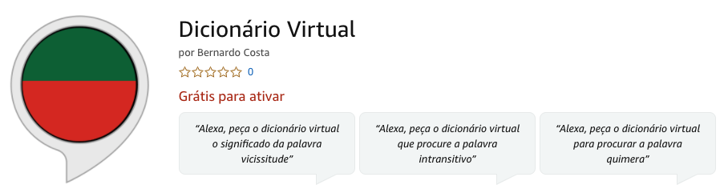

# Dicionário Virtual

[Amazon BR link](https://www.amazon.com.br/gp/product/B08G9SJBG7?ie=UTF8&path=%2Fgp%2Fproduct%2FB08G9SJBG7&ref_=skillrw_dsk_si_dp&useRedirectOnSuccess=1&)

## Description (PT):

"Consulte os significados de mais de 100 mil palavras em Português sem precisar digitar no Google, tudo por voz!Consulte os significados de mais de 100 mil palavras em Português sem precisar digitar no Google nem abrir um dicionário!

Para iniciar, apenas fale "Alexa, peça o dicionário virtual o significado da palavra ..." ou "Alexa, peça o dicionário virtual que procure a palavra ...".

Esse iniciativa é totalmente pessoal, sem fins lucrativos. Utilizamos o dicionário aberto (Português de Portugal) como fonte.

Se quiser inserir ou corrigir uma palavra, entre em contato pela botão de feedback.

Caso conheça alguma fonte em Português Brasileiro e queira fazer uma parceria, entre em contato pela botão de feedback!

Disponível em todos os países que falam português."

## 4Developers

You can add new word directly opening a pull request or an issue. 
Feel free to  

## Ref

- [dicionario aberto](https://dicionario-aberto.net/)

